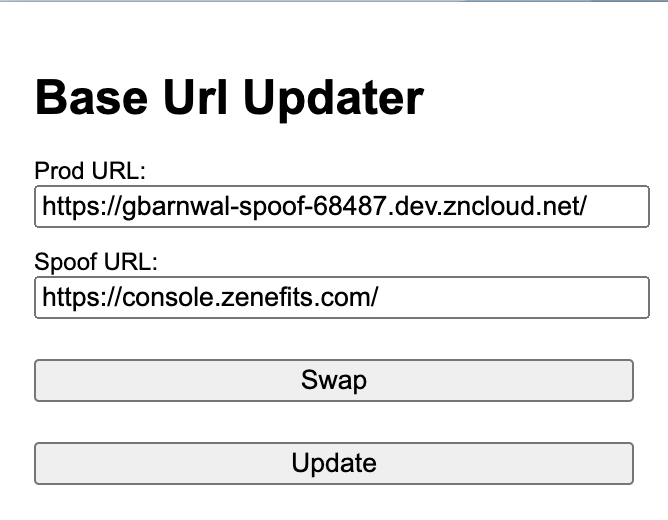
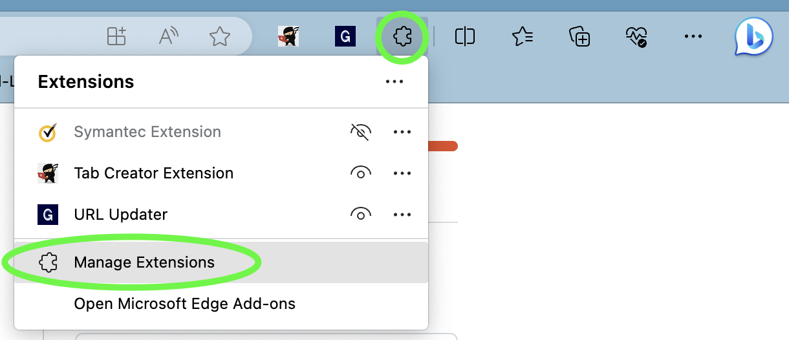
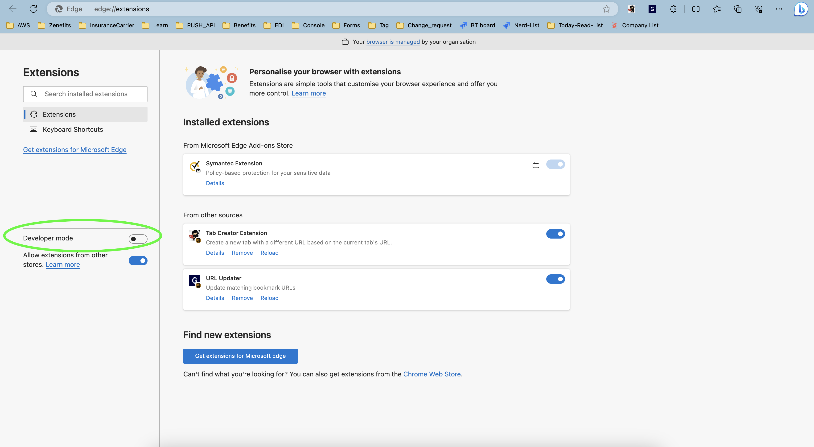
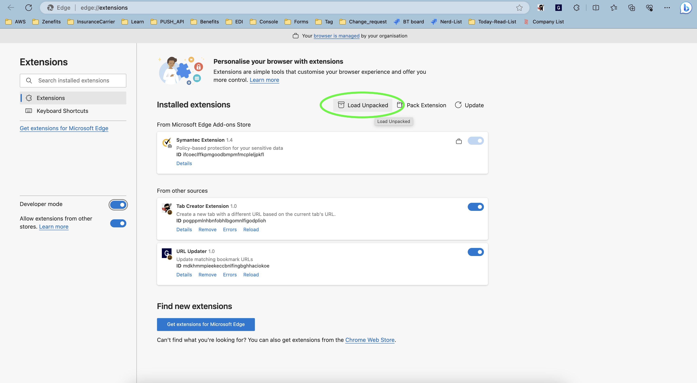
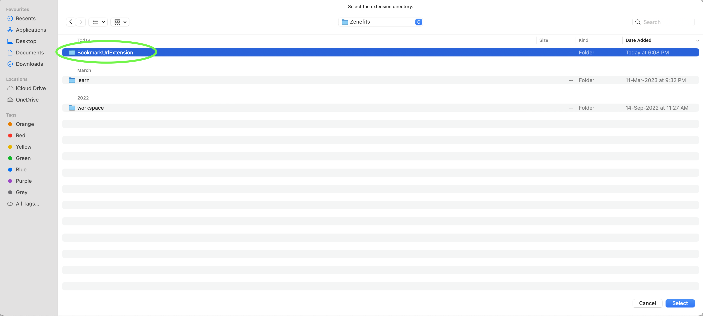

# BookmarkUrlExtension

**What**
  - It's an extension to update the base url of all the urls we have stored as a bookmark.

**Why**
  - To reduce time consume while copying/pasting/updating the base url every time we check spoof/prod/alpha/beta urls.

**How to Install**
- This can be use in both edge and chrome. For installing we need to turn on the developer mode of browser.
    - Clone this repo, using git clone <git_url>
    - Click on Manage Extension button on edge
      
    - Turn on Developer Mode
      
    - Click on Load Unpacked
      
    - Select the folder where repo has been cloned
      
    - Hurray! your extension has been added.
 
**How to Use**
- If we have these urls as boomark:
    - https://defkey.com/iterm-shortcuts
    - https://console.youtube.com/console/company/119883
    - https://console.youtube.com/console/object_detail/7558147/
- If I pass Prod url as https://console.youtube.com/ and Spoof url as https://gbarnwal.zncloud.net/ and click on "Update" button. 
- We will change all the above bookmark urls as below:
    - https://defkey.com/iterm-shortcuts
    - https://gourav.zncloud.net/console/company/119883
    - https://gourav.zncloud.net/console/object_detail/7558147/
- To change the base url to old state, we just need to click on "Swap" button first and then "Update" button.

